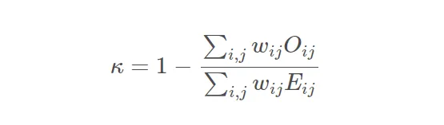

# Ordinal-Regression-with-a-Tabular-Wine-Quality
Kaggle Competition: https://www.kaggle.com/competitions/playground-series-s3e5/overview  
Dataset origins: Kaggle

This dataset consisted of 12 attributes — including the target variable —which tell us more about each wine, like how acidic it is, its pH, the amount of chlorides, alcohol levels, and so on.

Quadratic-Weighted Kappa formula